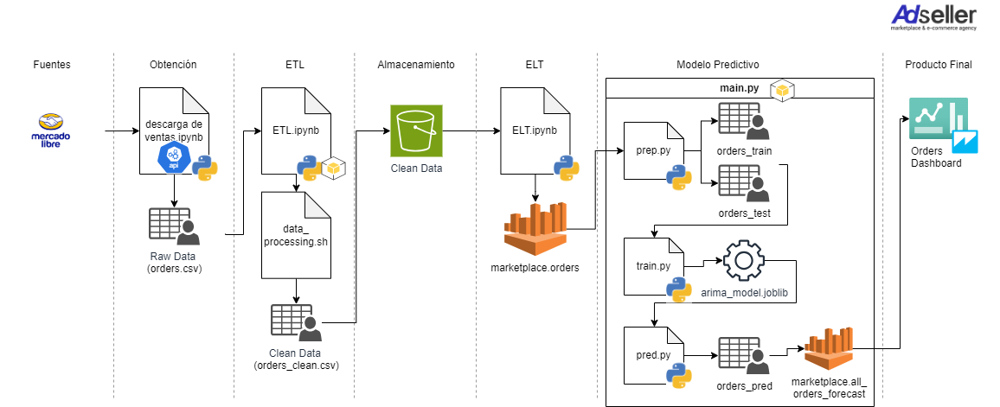

# Arquitectura de Producto de Datos - Proyecto Final

--------------------------------

## Objetivo ##
Adseller, una empresa líder en consultoría, estrategia y gestión de e-commerce y marketplace, anuncia hoy el lanzamiento de "Ad-InFo", una solución revolucionaria diseñada para transformar la manera en que las marcas gestionan y optimizan sus operaciones en plataformas de e-commerce. "Ad-InFo" se sitúa a la vanguardia de la innovación tecnológica, ofreciendo análisis predictivo avanzado y acceso a información de manera cotidiana que empodera a los negocios para anticipar tendencias de mercado y responder con efectividad a las dinámicas cambiantes del comercio electrónico.

### Características y Beneficios ###
Ad-InFo permite a los usuarios:
- Monitorear el rendimiento del producto diariamente con dashboards intuitivos y personalizables.
- Predecir tendencias de ventas utilizando modelos de machine learning de última generación.
- Optimizar estrategias de precios y promociones con análisis predictivo basado en patrones históricos y condiciones del mercado.

## Dependencias ##
XXX

## Esctructura ##

<pre><code>
project_root/
    |-- main.py
    |-- MELI - descarga de ventas.ipynb
    |-- data/
        |-- AWS/
            |-- orders_clean.csv
        |-- clean/
            |-- orders_pred.csv
            |-- orders_test.csv
            |-- orders_train.csv
        |-- raw/
            |-- orders.csv
        |-- orders.csv
    |-- src/
        |-- __init__.py
        |-- analytics.ipynb
        |-- data_processing.sh
        |-- ELT.ipynb
        |-- ETL.ipynb
        |-- pred.py
        |-- prep.py
        |-- train.py
    |-- artifacts/
        |-- models/
            |-- arima_model.joblib
    |-- environment.yml
    |-- api_meli_colch.env
    |-- README.md
    |-- results.log
    |-- Ad-InFo.png
    |-- Ad-InFo.drawio.html
    |-- .gitignore
</code></pre>

## Ejecución ##

1. Decargar los datos usando la api de mercado libre mediante la ejecución del archivo ./MELI - descarga de ventas.ipynb.
El output se guardará en /data/orders.csv.

2. Ejecutar el ETL de la ruta /src/ETL.ipynb, en donde limpiamos los datos llamando dentro del notebook al script ./src/data_preocessing.sh
El output se guardará en /data/AWS/orders_clean.csv.

3. Posteriormente se carga dicho archivo a s3 con ayuda de Athena en la ruta ./data/raw/orders.csv al ejecutar /src/ELT.ipynb 

4. Usamos los datos para entrenar un modelo ejecutando el notebook /src/analytics.ipynb.
Ejucutamos el script main.py para ejecutar el modelo con tres scripts de python preparandolos para usarse en la nube:
- En ./src/prep.py llamamos los datos desde Athena,los guardamos en /data/raw/orders.csv. Hacemos el train-test split y los guardamos en /data/clean/orders_train.csv y /data/clean/orders_test.csv.
- En ./src/train.py entrenamos el modelo con los datos y guardamos el modelo entrenado en ./artifacts/models/arima_model.joblib.
- En ./src/pred.py hacemos las prediciones y la guardamos en /data/clean/orders_pred.py.

## Arquitectura ##
<pre><code>
<iframe src="Ad-InFo.drawio.html" width="100%" height="600px"></iframe>
</code></pre>